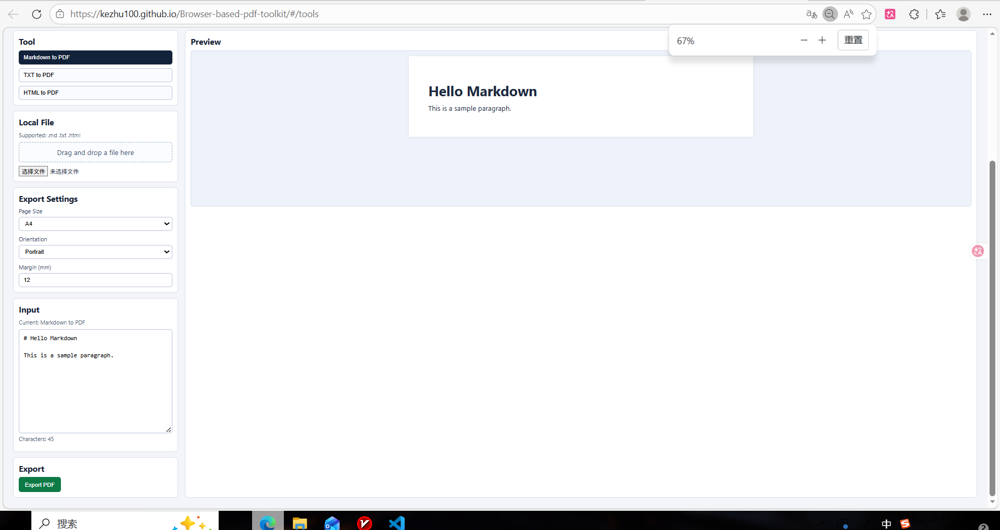

# Browser-based PDF Toolkit / 浏览器端 PDF 工具箱

A browser-only PDF toolkit focused on privacy, zero backend cost, and simple usability.  
一个专注于隐私保护、零后端成本和易用性的纯浏览器端 PDF 工具箱。

This project is fully frontend and designed for static deployment. All processing runs locally in the browser.  
本项目完全基于前端实现，面向静态部署设计，所有处理均在浏览器本地完成。

This project was entirely completed by Codex,including designing the architecture and writing the code. I have no front-end experience at all.
这个项目完全是由 Codex 完成的，包括设计架构和编写代码。而我完全没有前端开发的经验。

## Live Demo / 在线演示

https://kezhu100.github.io/Browser-based-pdf-toolkit/#/

## Screenshot / 项目截图



## Current Features / 当前功能

### Implemented tools / 已实现工具

- Markdown -> PDF
- TXT -> PDF
- HTML -> PDF
- Image -> PDF
- Merge PDF
- Split PDF
- Rotate PDF

- Markdown 转 PDF
- TXT 转 PDF
- HTML 转 PDF
- 图片转 PDF
- PDF 合并
- PDF 拆分
- PDF 旋转

### Implemented workspace families / 已实现工作区类型

- Content workspace
- Image workspace
- PDF workspace

- 内容工作区
- 图片工作区
- PDF 工作区

### Behavior / 功能特点

- browser-only processing
- no backend
- no server upload
- automatic preview
- explicit export/apply action
- local browser download

- 纯浏览器端处理
- 无后端服务
- 不上传文件到服务器
- 自动预览
- 手动导出 / 执行操作
- 浏览器本地下载结果

## Current PDF Manipulation Status / 当前 PDF 编辑功能状态

### Implemented / 已实现

- `merge-pdf`
- `split-pdf`
- `rotate-pdf`

### Not implemented yet / 尚未实现

- `reorder-pdf`
- `watermark-pdf`
- `page-numbers-pdf`
- `crop-pdf`

## Tech Stack / 技术栈

- React
- TypeScript
- Vite
- React Router
- html2pdf.js
- pdf-lib
- DOMPurify
- marked
- Zustand
## Local Development

```bash
npm install
npm run dev
```

Open:

```text
http://localhost:5173
```

## Build

```bash
npm run build
```

## Deploy

Deployment is automated with GitHub Actions.

Every push to the `main` branch triggers build and deploy to GitHub Pages.

Important deployment constraints:

- static hosting only
- `HashRouter` compatibility
- no backend server

## Latest Capabilities

### Content tools

- Markdown/TXT/HTML input
- local file upload
- live preview
- export settings:
  - page size
  - orientation
  - margin

### Image tools

- PNG / JPG / JPEG / WEBP support
- single image -> single-page PDF
- multiple images -> multi-page PDF
- local browser processing

### PDF tools

- Merge multiple PDF files in browser
- Split one PDF into separate single-page PDFs
- Rotate one PDF by 90 / 180 / 270 degrees
- local file validation
- lightweight operation summary preview
- browser download for merged, split, or rotated results

## Architecture Notes

- keeps the existing ToolPlugin system
- content/image tools use the document pipeline
- PDF manipulation tools extend the `pdf-engine` path
- workspace routing is handled through a workspace-family router

## Roadmap

Completed:

- content -> PDF
- image -> PDF
- merge PDF
- split PDF
- rotate PDF

Planned next:

- reorder/delete page workflows
- watermark and page numbers

## Constraints

This project must remain:

- browser-only
- privacy-friendly
- GitHub Pages deployable
- no backend
- no cloud file processing
